# FIT PLACE24 様向け
# Lark統合活用による業務効率化提案書

**作成日**: 2024年12月25日
**提案者**: [提案会社名]
**バージョン**: 2.0

---

## エグゼクティブサマリー

FIT PLACE24様は全国170店舗以上を展開し、今後さらなる店舗拡大を目指されています。現在、複数のツール（Lark、Google Workspace、Notion、LINE等）が併存し、情報の分散と業務の非効率が生じています。

**本提案のゴール**：
- **Larkへの統合**により、ツール乱立を解消
- **店舗・オーナー管理の一元化**で問い合わせ対応工数を50%削減
- **Lark Baseによるデータ可視化**で経営判断を迅速化
- **店舗拡大に対応できる基盤**を構築

**想定効果**：
- ITツールコスト：年間30-40%削減
- 問い合わせ対応時間：50%削減
- 意思決定スピード：2倍向上

---

## 1. 現状分析

### 1.1 現在のツール構成

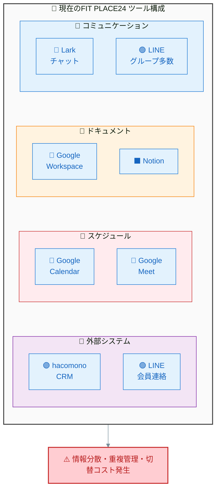

### 1.2 特定された課題

| # | 課題 | 影響 | 深刻度 |
|---|------|------|:------:|
| 1 | **LINEグループの乱立** | オーナー・店舗・工事業者ごとにグループが増殖、情報が追えない | 🔴 高 |
| 2 | **問い合わせ対応の属人化** | 開業時・運営時の問い合わせが特定担当者に集中 | 🔴 高 |
| 3 | **データの見える化不足** | 各店舗の売上・会員数がhacomonoにあるが一覧化されていない | 🔴 高 |
| 4 | **ツールの分散** | Lark/Google/Notion間でドキュメントが散在 | 🟡 中 |
| 5 | **店舗拡大への対応** | 170店舗→さらに拡大時、現行体制では限界 | 🟡 中 |

### 1.3 課題の詳細分析

#### 課題①：LINEグループの乱立

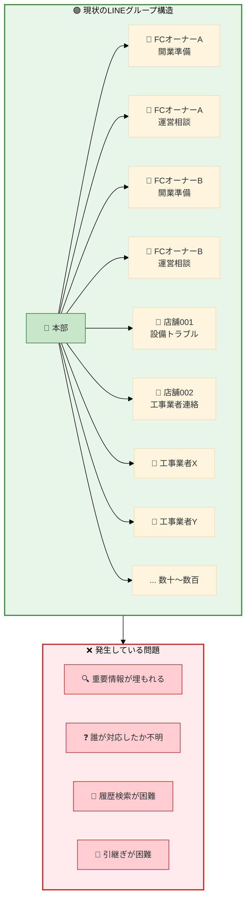

#### 課題②：問い合わせ対応の肥大化

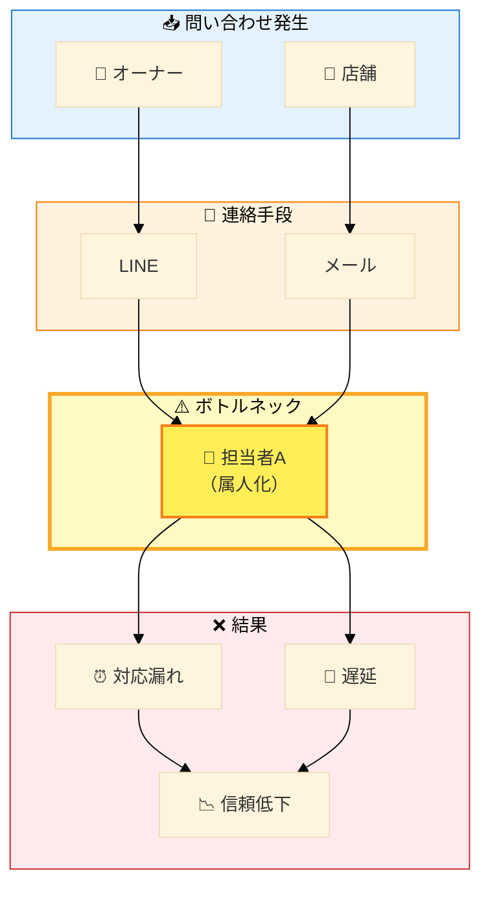

**月間対応件数（推定）**

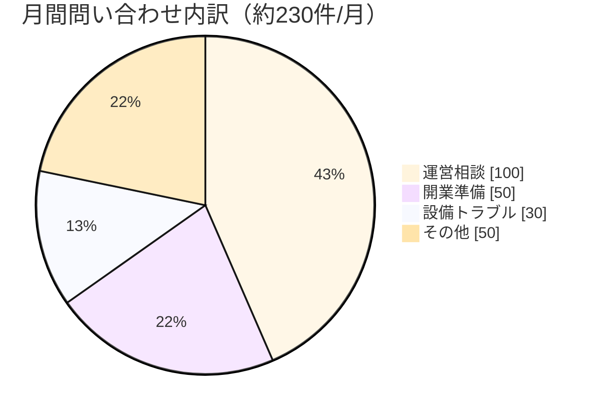

#### 課題③：データの見える化不足

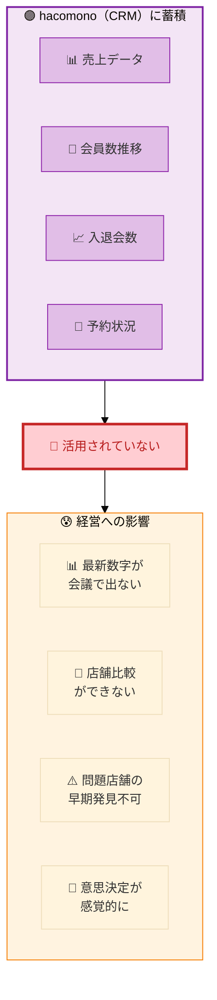

---

## 2. 提案：Lark統合ソリューション

### 2.1 To-Be 構成

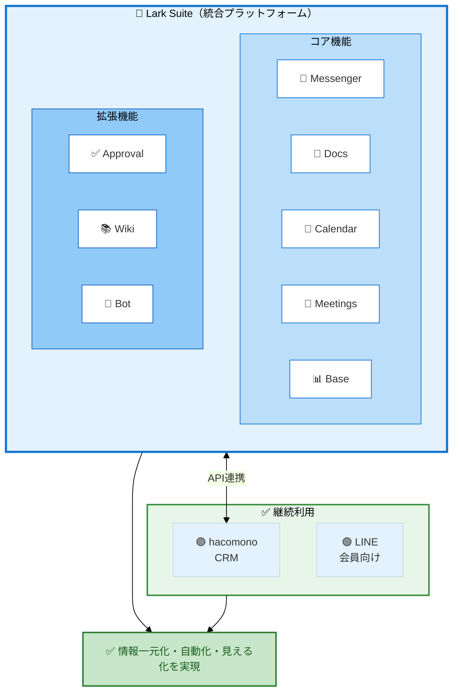

### 2.2 残すもの・置き換えるもの

| ツール | 判断 | 理由 |
|--------|:----:|------|
| **Lark** | ✅ 拡張 | 既に導入済み。全機能をフル活用 |
| **hacomono** | ✅ 継続 | CRMとして継続利用、Lark Baseと連携 |
| **LINE（会員向け）** | ✅ 継続 | 会員との連絡手段として継続 |
| Google Workspace | ❌ 廃止 | Lark Docs/Sheetsに移行 |
| Notion | ❌ 廃止 | Lark Wiki/Docsに移行 |
| Google Calendar | ❌ 廃止 | Lark Calendarに移行 |
| Google Meet | ❌ 廃止 | Lark Meetingsに移行 |
| LINE（業務用グループ） | ❌ 廃止 | Lark Messengerに移行 |

---

## 3. ソリューション詳細

### 3.1 課題①解決：LINEグループ → Lark組織チャット

#### Before vs After 比較

```mermaid
%%{init: {'theme': 'base', 'themeVariables': {'fontSize': '13px'}}}%%
flowchart LR
    subgraph before["❌ Before: LINE"]
        direction TB
        B1["グループ乱立"]
        B2["検索困難"]
        B3["ファイル管理不可"]
        B4["権限管理なし"]
    end

    arrow["➡️"]

    subgraph after["✅ After: Lark"]
        direction TB
        A1["組織的に整理"]
        A2["全文検索可能"]
        A3["ファイル一元管理"]
        A4["細かい権限設定"]
    end

    before --> arrow --> after

    style before fill:#ffebee,stroke:#c62828,stroke-width:2px
    style after fill:#e8f5e9,stroke:#388e3c,stroke-width:2px
    style arrow fill:#fff,stroke:#fff
    style B1 fill:#ffcdd2,stroke:#e57373
    style B2 fill:#ffcdd2,stroke:#e57373
    style B3 fill:#ffcdd2,stroke:#e57373
    style B4 fill:#ffcdd2,stroke:#e57373
    style A1 fill:#c8e6c9,stroke:#66bb6a
    style A2 fill:#c8e6c9,stroke:#66bb6a
    style A3 fill:#c8e6c9,stroke:#66bb6a
    style A4 fill:#c8e6c9,stroke:#66bb6a
```

#### Lark組織構造（提案）

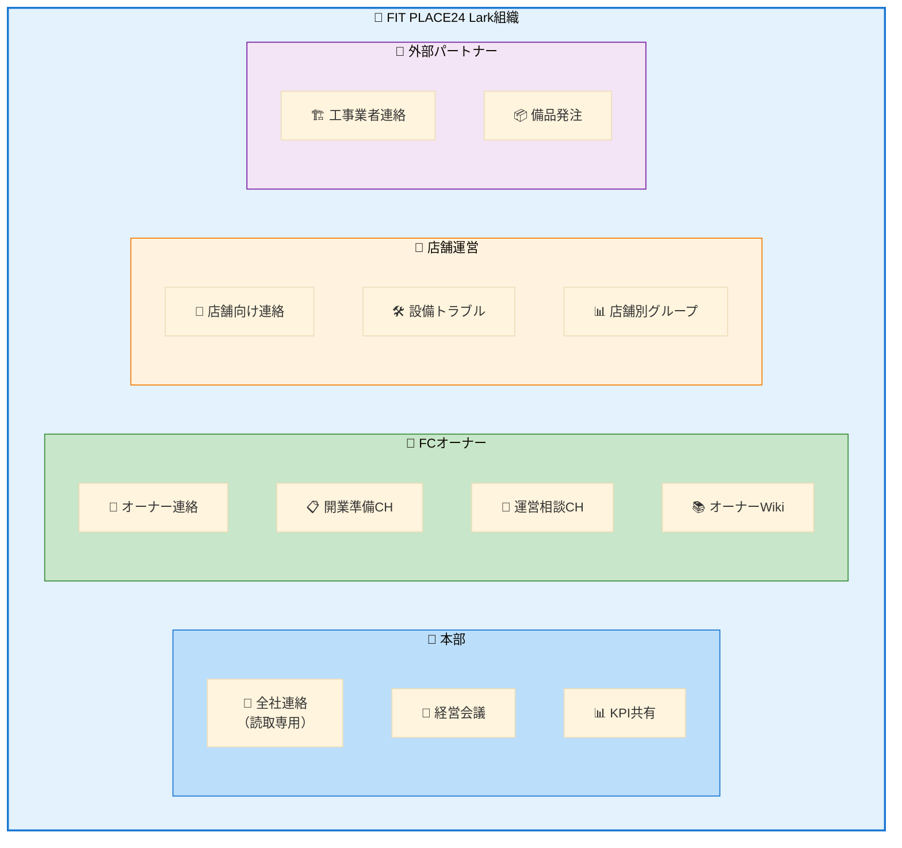

**Lark導入のメリット**：
- **スレッド機能**で会話が整理される
- **検索機能**で過去の情報をすぐ発見
- **ファイル管理**でドキュメントを一元管理
- **権限設定**で情報アクセスを制御
- **Bot連携**で自動振り分け・通知

### 3.2 課題②解決：問い合わせ対応の自動化

#### 新・問い合わせフロー

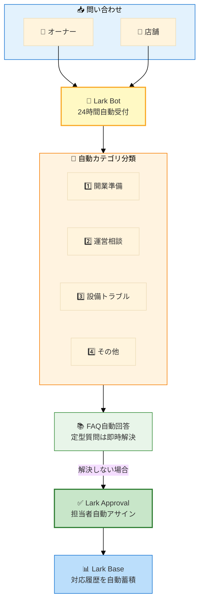

**期待効果**：

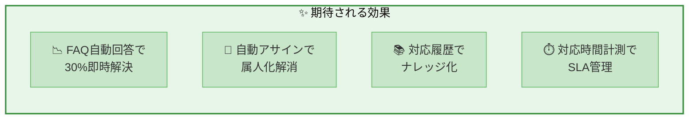

### 3.3 課題③解決：Lark Baseによるデータ可視化

#### hacomono → Lark Base 連携

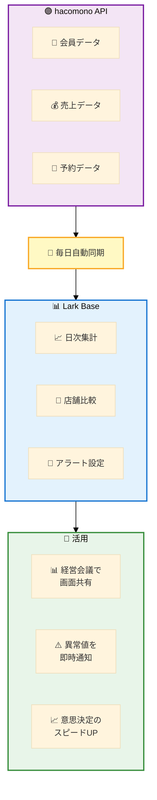

#### 経営ダッシュボードイメージ

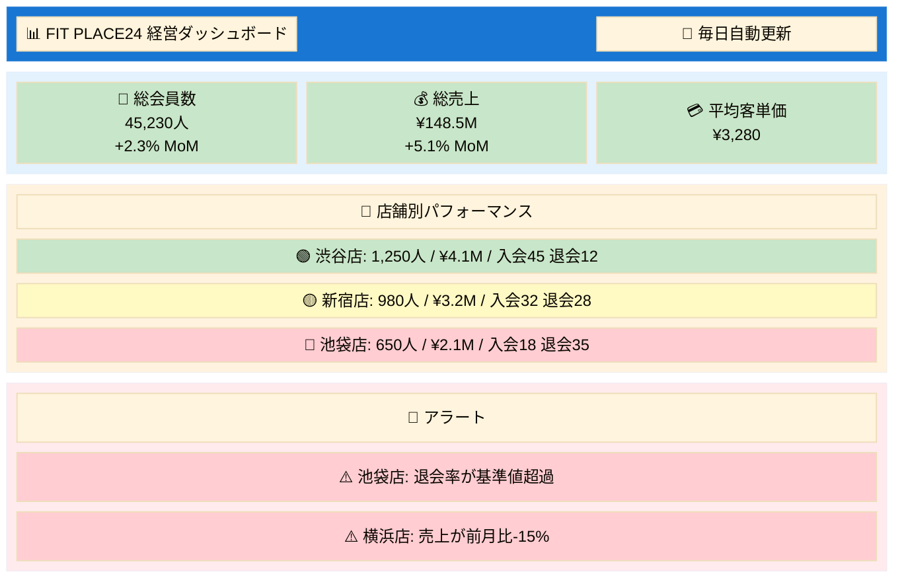

### 3.4 店舗拡大対応：開業オペレーションの標準化

#### 新店舗開業テンプレート

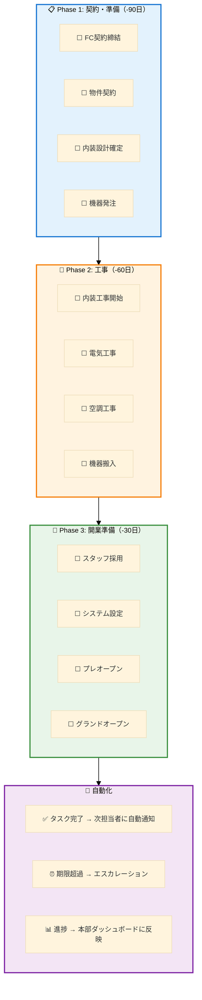

---

## 4. 導入効果試算

### 4.1 コスト削減

| 項目 | 現状（月額） | 導入後（月額） | 削減額 |
|------|-------------|---------------|--------|
| Google Workspace（50名） | ¥68,000 | ¥0 | ¥68,000 |
| Notion（30名） | ¥45,000 | ¥0 | ¥45,000 |
| Lark Pro（80名） | ¥0 | ¥120,000 | -¥120,000 |
| **合計** | **¥113,000** | **¥120,000** | **+¥7,000** |

※ コストは微増だが、以下の業務効率化効果で十分回収

### 4.2 業務効率化効果

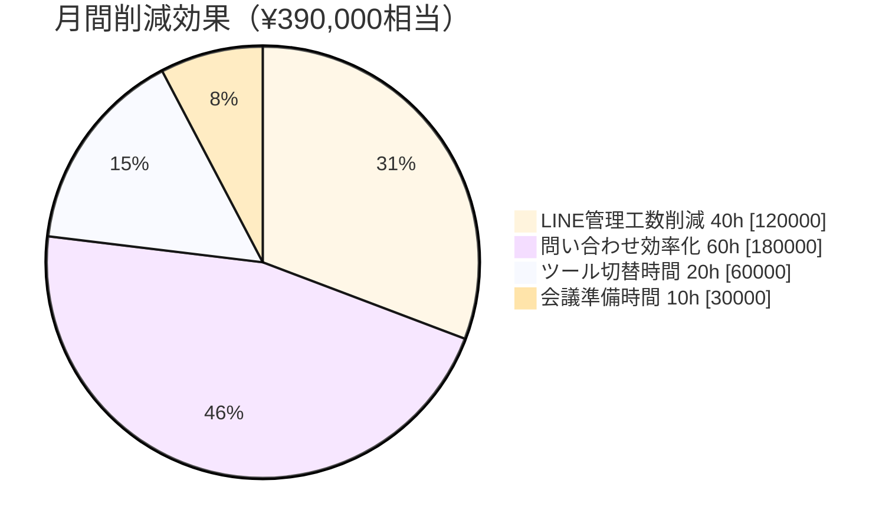

| 効果項目 | 削減時間/月 | 金額換算（時給¥3,000） |
|----------|------------|----------------------|
| LINE管理工数削減 | 40時間 | ¥120,000 |
| 問い合わせ対応効率化 | 60時間 | ¥180,000 |
| ツール切替・検索時間 | 20時間 | ¥60,000 |
| 会議準備時間 | 10時間 | ¥30,000 |
| **合計** | **130時間** | **¥390,000/月** |

**年間削減効果: 約470万円相当**

### 4.3 定性的効果

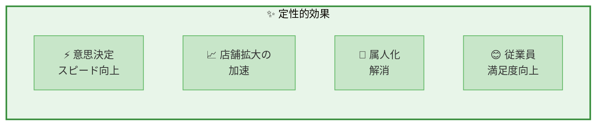

---

## 5. 導入スケジュール

### 全体スケジュール（3ヶ月）

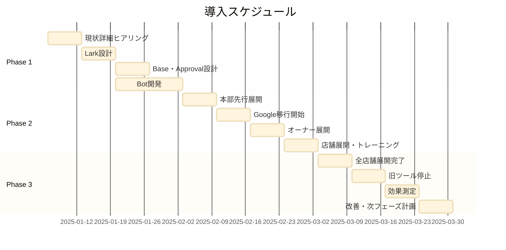

### Phase 1: 設計・準備（Week 1-4）

- [ ] 現状業務フローの詳細ヒアリング
- [ ] Lark組織構造の設計
- [ ] Lark Base（ダッシュボード）設計
- [ ] hacomono API連携設計
- [ ] 問い合わせBot設計
- [ ] 移行計画策定
- [ ] トレーニング資料作成

### Phase 2: 移行・展開（Week 5-8）

- [ ] 本部メンバーへの先行展開
- [ ] Google Workspace → Lark Docs移行
- [ ] Notion → Lark Wiki移行
- [ ] LINE業務グループ → Lark移行
- [ ] FCオーナーへの展開・トレーニング
- [ ] 店舗スタッフへの展開
- [ ] hacomono連携開始

### Phase 3: 定着・最適化（Week 9-12）

- [ ] 全店舗展開完了
- [ ] 旧ツール（Google/Notion/LINE業務）停止
- [ ] 効果測定・KPIレビュー
- [ ] 改善点の洗い出し・対応
- [ ] 運用ルールの最終化
- [ ] 次フェーズ計画（AI活用など）

---

## 6. 成功のためのポイント

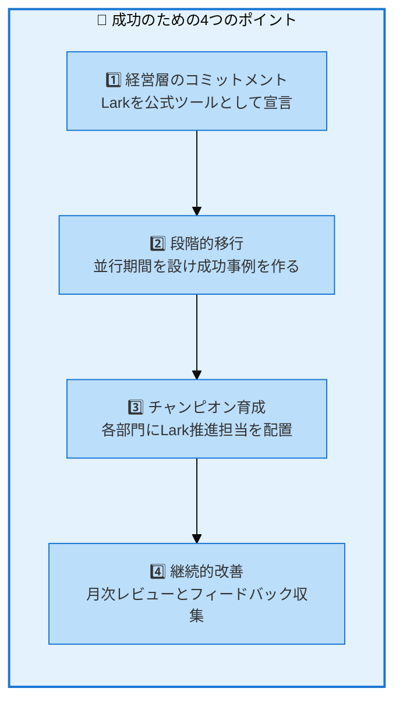

---

## 7. なぜ今Larkなのか

### 7.1 店舗拡大フェーズに最適

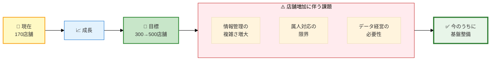

### 7.2 競合ツールとの比較（フランチャイズ観点）

| 要件 | Lark | Slack+他 | Teams |
|------|:----:|:--------:|:-----:|
| オールインワン | ⭕ | ❌ | △ |
| 外部ユーザー管理 | ⭕ | △ | △ |
| ノーコードDB | ⭕ | ❌ | ❌ |
| ワークフロー | ⭕ | △ | △ |
| コスト | ◎ | ❌ | △ |
| 導入しやすさ | ⭕ | △ | ❌ |

---

## 8. 次のステップ

### 即時アクション

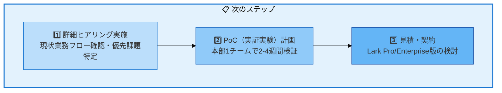

### お問い合わせ

本提案についてのご質問・ご相談は下記までお気軽にご連絡ください。

| 項目 | 内容 |
|------|------|
| **提案会社名** | [提案会社名] |
| **担当者** | [担当者名] |
| **Email** | [email] |
| **Tel** | [電話番号] |

---

## 付録

### A. Lark機能一覧

| 機能 | 説明 | FIT PLACE24での活用 |
|------|------|-------------------|
| Messenger | チャット | 本部-オーナー-店舗連絡 |
| Docs | ドキュメント | マニュアル、議事録 |
| Sheets | スプレッドシート | 計画表、一覧管理 |
| Base | ノーコードDB | KPIダッシュボード、案件管理 |
| Calendar | カレンダー | 予定共有、会議室予約 |
| Meetings | ビデオ会議 | オーナー会議、店舗MTG |
| Approval | 承認ワークフロー | 申請・承認の自動化 |
| Wiki | ナレッジベース | FAQ、業務マニュアル |
| Bot | チャットボット | 問い合わせ自動対応 |

### B. hacomono連携イメージ

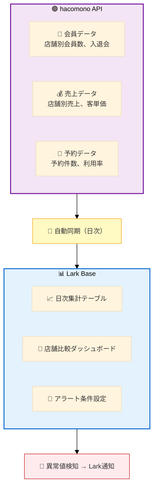

### C. 用語集

| 用語 | 説明 |
|------|------|
| Lark Base | Larkのノーコードデータベース。Airtableに似た機能 |
| Approval | Larkの承認ワークフロー機能 |
| hacomono | フィットネス業界向けCRM/予約システム |
| FC | フランチャイズ |
| KPI | Key Performance Indicator（重要業績評価指標） |
| SLA | Service Level Agreement（サービス品質保証） |

---

*この提案書は [Claude Code](https://claude.com/claude-code) により生成されました*

**FIT PLACE24様の更なる成長を、Larkがサポートします。**
