# FIT PLACE24 様向け
# Lark統合活用による業務効率化提案書

**作成日**: 2024年12月25日
**提案者**: [提案会社名]
**バージョン**: 1.0

---

## エグゼクティブサマリー

FIT PLACE24様は全国170店舗以上を展開し、今後さらなる店舗拡大を目指されています。現在、複数のツール（Lark、Google Workspace、Notion、LINE等）が併存し、情報の分散と業務の非効率が生じています。

**本提案のゴール**：
- **Larkへの統合**により、ツール乱立を解消
- **店舗・オーナー管理の一元化**で問い合わせ対応工数を50%削減
- **Lark Baseによるデータ可視化**で経営判断を迅速化
- **店舗拡大に対応できる基盤**を構築

**想定効果**：
- ITツールコスト：年間30-40%削減
- 問い合わせ対応時間：50%削減
- 意思決定スピード：2倍向上

---

## 1. 現状分析

### 1.1 現在のツール構成

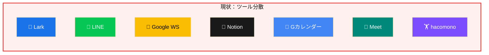

**問題点**: 情報分散・重複管理・ツール切替コスト発生

### 1.2 特定された課題

| # | 課題 | 影響 | 深刻度 |
|---|------|------|:------:|
| 1 | **LINEグループの乱立** | オーナー・店舗・工事業者ごとにグループが増殖 | 🔴 高 |
| 2 | **問い合わせ対応の属人化** | 開業時・運営時の問い合わせが特定担当者に集中 | 🔴 高 |
| 3 | **データの見える化不足** | 各店舗の売上・会員数が一覧化されていない | 🔴 高 |
| 4 | **ツールの分散** | Lark/Google/Notion間でドキュメントが散在 | 🟡 中 |
| 5 | **店舗拡大への対応** | 170店舗→拡大時、現行体制では限界 | 🟡 中 |

### 1.3 課題の詳細分析

#### 課題①：LINEグループの乱立

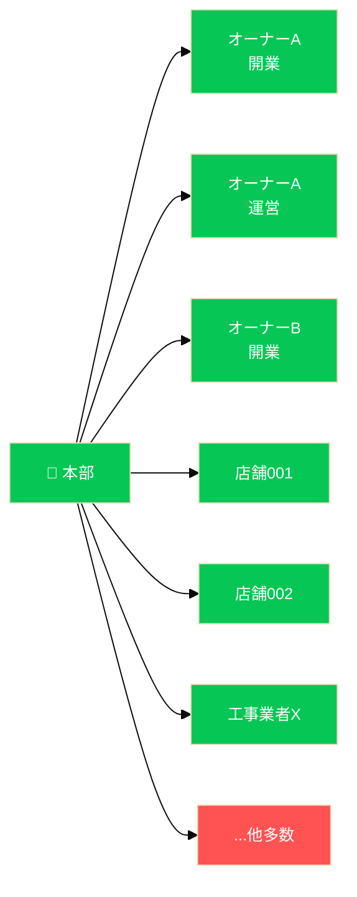

**問題点**：
- ❌ 重要情報が埋もれる
- ❌ 対応者が不明
- ❌ 検索困難
- ❌ 引継ぎ困難

#### 課題②：問い合わせ対応の肥大化

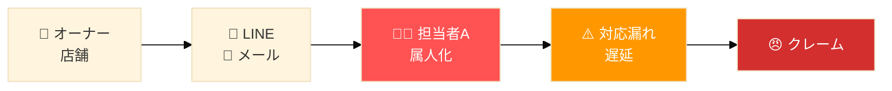

**対応件数（推定）**：月間 約230件

| カテゴリ | 件数/月 |
|----------|---------|
| 開業準備関連 | 50件 |
| 運営相談 | 100件 |
| 設備トラブル | 30件 |
| その他 | 50件 |

#### 課題③：データの見える化不足

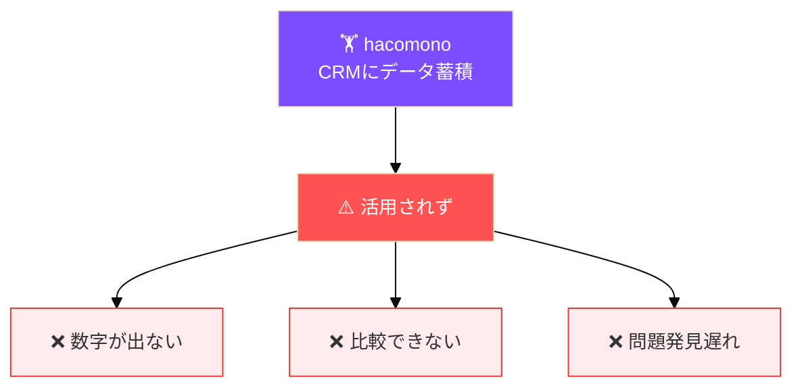

---

## 2. 提案：Lark統合ソリューション

### 2.1 To-Be 構成

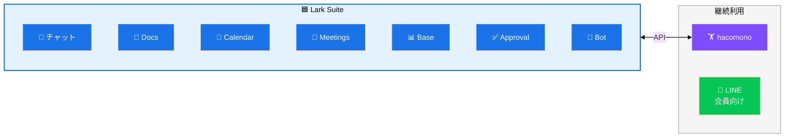

### 2.2 残すもの・置き換えるもの

| ツール | 判断 | 理由 |
|--------|:----:|------|
| **Lark** | ✅ 拡張 | 既に導入済み。全機能をフル活用 |
| **hacomono** | ✅ 継続 | CRMとして継続、Lark Baseと連携 |
| **LINE（会員向け）** | ✅ 継続 | 会員との連絡手段として継続 |
| Google Workspace | ❌ 廃止 | Lark Docs/Sheetsに移行 |
| Notion | ❌ 廃止 | Lark Wiki/Docsに移行 |
| Google Calendar | ❌ 廃止 | Lark Calendarに移行 |
| Google Meet | ❌ 廃止 | Lark Meetingsに移行 |
| LINE（業務用） | ❌ 廃止 | Lark Messengerに移行 |

---

## 3. ソリューション詳細

### 3.1 課題①解決：LINEグループ → Lark組織チャット

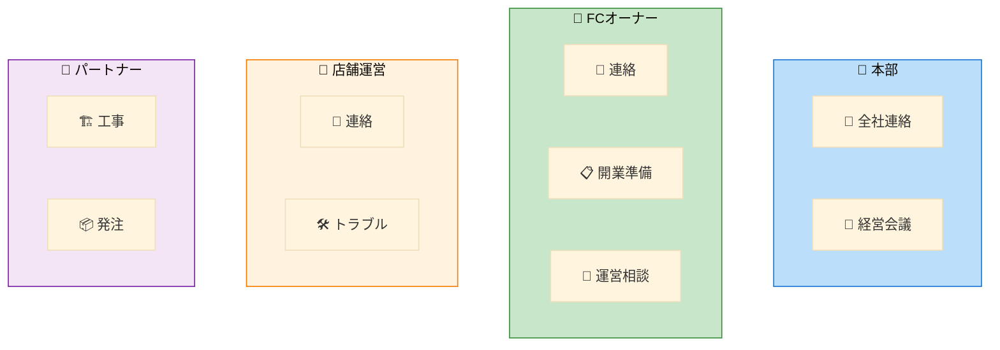

**メリット**：
| 機能 | 効果 |
|------|------|
| スレッド | 会話整理 |
| 検索 | 過去情報発見 |
| ファイル | 一元管理 |
| 権限 | アクセス制御 |
| Bot | 自動振分 |

### 3.2 課題②解決：問い合わせ対応の自動化

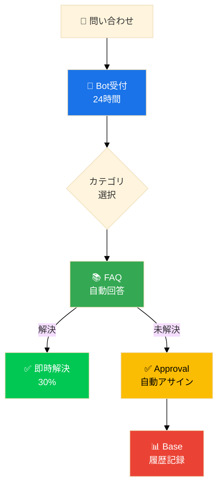

**期待効果**：

| 効果 | 詳細 |
|------|------|
| FAQ自動回答 | 30%即時解決 |
| 自動アサイン | 属人化解消 |
| 履歴蓄積 | ナレッジ化 |
| 時間計測 | SLA管理 |

### 3.3 課題③解決：Lark Baseによるデータ可視化

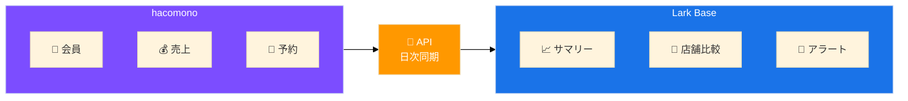

#### 経営ダッシュボードイメージ

| 指標 | 値 | 前月比 |
|------|-----|--------|
| 総会員数 | 45,230人 | +2.3% |
| 総売上 | ¥148.5M | +5.1% |
| 平均客単価 | ¥3,280 | +1.2% |

| 店舗 | 会員数 | 売上 | 状態 |
|------|--------|------|:----:|
| 渋谷店 | 1,250 | ¥4.1M | 🟢 |
| 新宿店 | 980 | ¥3.2M | 🟡 |
| 池袋店 | 650 | ¥2.1M | 🔴 |

**🚨 アラート例**：
- 池袋店: 退会率が基準値超過
- 横浜店: 売上が前月比-15%

### 3.4 店舗拡大対応：開業オペレーションの標準化

```mermaid
%%{init: {'theme': 'base', 'themeVariables': { 'fontSize': '12px'}}}%%
gantt
    title 新店舗開業（90日）
    dateFormat X
    axisFormat %s

    section 契約準備
    FC契約     :done, 90, 80
    物件契約   :done, 85, 75
    設計確定   :done, 80, 70
    機器発注   :done, 75, 65

    section 工事
    内装工事   :active, 60, 40
    電気工事   :active, 55, 40
    機器搬入   :35, 30

    section 開業準備
    採用       :30, 15
    システム   :20, 10
    オープン   :milestone, 0, 0
```

**自動化ポイント**：
- ✅ タスク完了 → 次担当者に自動通知
- ✅ 期限超過 → エスカレーション
- ✅ 進捗 → 本部ダッシュボードに自動反映

---

## 4. 導入効果試算

### 4.1 コスト比較

| 項目 | 現状/月 | 導入後/月 | 差額 |
|------|---------|-----------|------|
| Google WS（50名） | ¥68,000 | ¥0 | ¥68,000 |
| Notion（30名） | ¥45,000 | ¥0 | ¥45,000 |
| Lark Pro（80名） | ¥0 | ¥120,000 | -¥120,000 |
| **合計** | **¥113,000** | **¥120,000** | **+¥7,000** |

※ コストは微増だが、業務効率化効果で十分回収

### 4.2 業務効率化効果

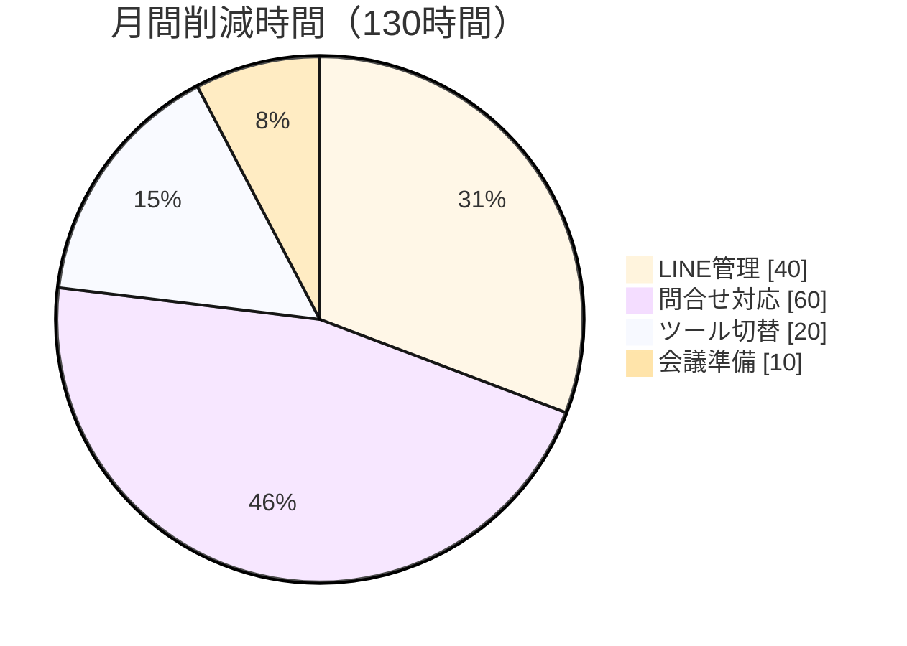

| 効果項目 | 削減時間/月 | 金額換算 |
|----------|------------|----------|
| LINE管理工数 | 40時間 | ¥120,000 |
| 問い合わせ対応 | 60時間 | ¥180,000 |
| ツール切替・検索 | 20時間 | ¥60,000 |
| 会議準備 | 10時間 | ¥30,000 |
| **合計** | **130時間** | **¥390,000/月** |

### 🎯 年間削減効果: 約470万円相当

### 4.3 定性的効果

- **意思決定スピード向上**: データがリアルタイムで見える
- **店舗拡大の加速**: 開業オペレーションが標準化
- **属人化解消**: ナレッジが組織に蓄積
- **従業員満足度向上**: ツールのストレス軽減

---

## 5. 導入スケジュール

### 全体スケジュール（3ヶ月）

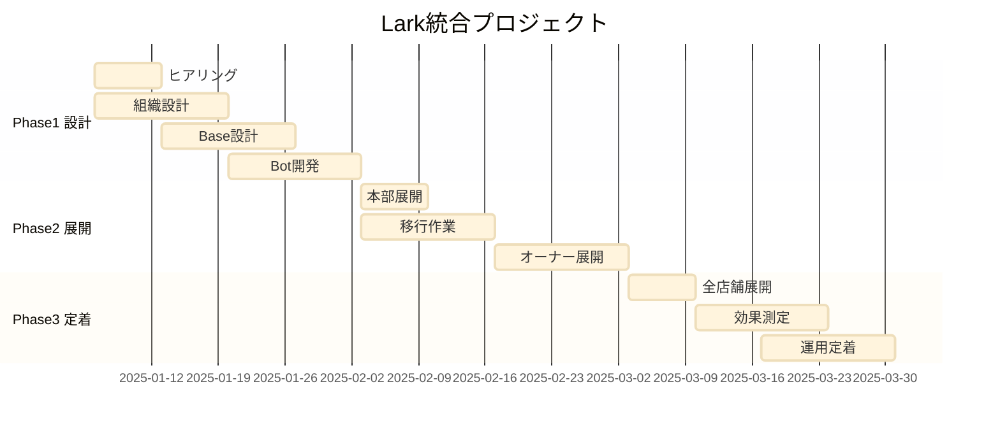

### Phase 1: 設計・準備（Week 1-4）

- [ ] 現状業務フローの詳細ヒアリング
- [ ] Lark組織構造の設計
- [ ] Lark Base（ダッシュボード）設計
- [ ] hacomono API連携設計
- [ ] 問い合わせBot設計

### Phase 2: 移行・展開（Week 5-8）

- [ ] 本部メンバーへの先行展開
- [ ] Google Workspace → Lark Docs移行
- [ ] Notion → Lark Wiki移行
- [ ] LINE業務グループ → Lark移行
- [ ] FCオーナーへの展開・トレーニング

### Phase 3: 定着・最適化（Week 9-12）

- [ ] 全店舗展開完了
- [ ] 旧ツール停止
- [ ] 効果測定・KPIレビュー
- [ ] 運用ルールの最終化

---

## 6. 成功のためのポイント

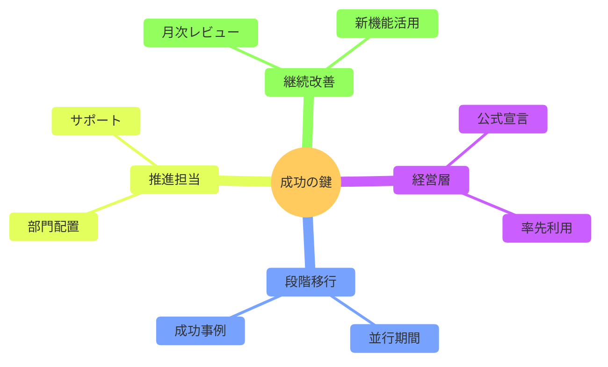

---

## 7. なぜ今Larkなのか

### 7.1 店舗拡大フェーズに最適

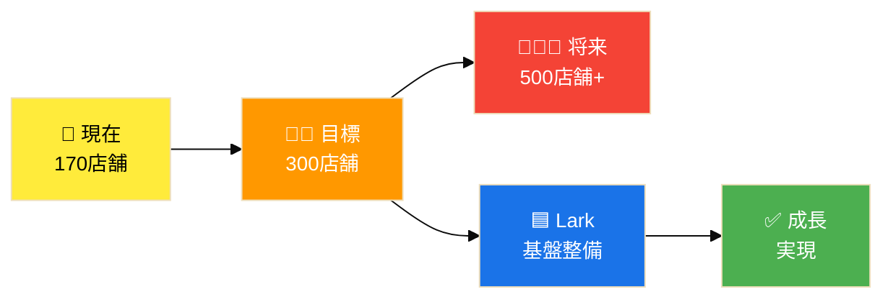

**店舗数が増えるほど**：
- 📈 情報管理の複雑さは指数関数的に増加
- 👤 属人的な対応は限界に達する
- 📊 データに基づく経営判断が不可欠に

→ **今のうちに基盤を整備** → スケーラブルな成長を実現

### 7.2 Larkの強み（フランチャイズ運営向け）

| 機能 | メリット |
|------|----------|
| **組織構造** | 本部→オーナー→店舗の階層管理 |
| **Base** | 全店舗KPIの一元管理・可視化 |
| **Approval** | 承認フローの標準化・自動化 |
| **Bot** | 定型問い合わせの自動対応 |
| **Wiki** | マニュアル・FAQの一元管理 |
| **外部招待** | オーナー・業者を柔軟に招待 |

### 7.3 競合ツールとの比較

| 要件 | Lark | Slack+他 | Teams |
|------|:----:|:--------:|:-----:|
| オールインワン | ⭕ | ❌ | 🔺 |
| 外部ユーザー | ⭕ | 🔺 | 🔺 |
| ノーコードDB | ⭕ | ❌ | ❌ |
| ワークフロー | ⭕ | 🔺 | 🔺 |
| コスト | ◎ | ❌ | 🔺 |
| 導入しやすさ | ⭕ | 🔺 | ❌ |

---

## 8. 次のステップ

### 即時アクション

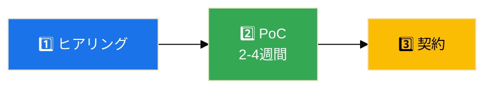

| ステップ | 内容 |
|----------|------|
| **1. ヒアリング** | 業務フロー確認、優先課題特定 |
| **2. PoC** | 本部1チームで先行、効果検証 |
| **3. 契約** | Lark見積取得、導入支援検討 |

### お問い合わせ

本提案についてのご質問・ご相談は下記までお気軽にご連絡ください。

| 項目 | 内容 |
|------|------|
| 会社名 | [提案会社名] |
| 担当者 | [担当者名] |
| Email | [email] |
| Tel | [電話番号] |

---

## 付録

### A. Lark機能一覧

| 機能 | 説明 | FIT PLACE24での活用 |
|------|------|-------------------|
| Messenger | チャット | 本部-オーナー-店舗連絡 |
| Docs | ドキュメント | マニュアル、議事録 |
| Sheets | スプレッドシート | 計画表、一覧管理 |
| Base | ノーコードDB | KPIダッシュボード |
| Calendar | カレンダー | 予定共有 |
| Meetings | ビデオ会議 | オーナー会議 |
| Approval | 承認フロー | 申請・承認の自動化 |
| Wiki | ナレッジ | FAQ、業務マニュアル |
| Bot | チャットボット | 問い合わせ自動対応 |

### B. hacomono連携イメージ

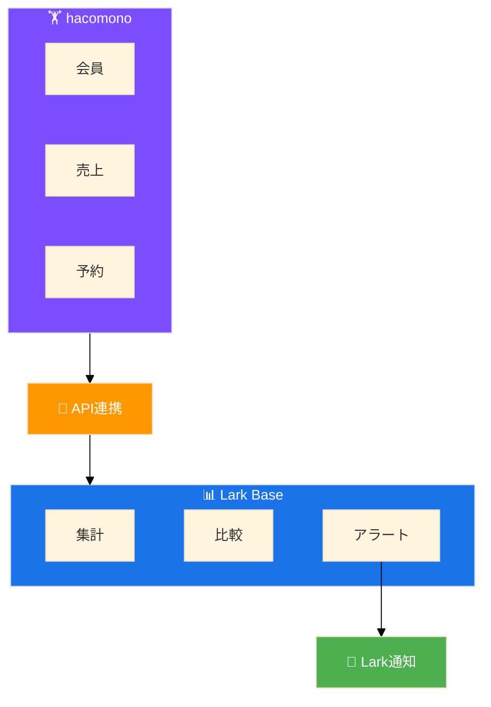

### C. 用語集

| 用語 | 説明 |
|------|------|
| Lark Base | ノーコードDB（Airtable類似） |
| Approval | 承認ワークフロー機能 |
| hacomono | フィットネス業界向けCRM |
| FC | フランチャイズ |
| KPI | 重要業績評価指標 |
| SLA | サービス品質保証 |

---

*この提案書は [Claude Code](https://claude.com/claude-code) により生成されました*

**FIT PLACE24様の更なる成長を、Larkがサポートします。**
