# FIT PLACE24 様向け
# Lark統合活用による業務効率化提案書

**作成日**: 2024年12月25日
**提案者**: [提案会社名]
**バージョン**: 1.0

---

## エグゼクティブサマリー

FIT PLACE24様は全国170店舗以上を展開し、今後さらなる店舗拡大を目指されています。現在、複数のツール（Lark、Google Workspace、Notion、LINE等）が併存し、情報の分散と業務の非効率が生じています。

### 本提案のゴール

| ゴール | 期待効果 |
|:------:|:--------:|
| Larkへの統合 | ツール乱立を解消 |
| 店舗・オーナー管理の一元化 | 問い合わせ対応工数50%削減 |
| Lark Baseによるデータ可視化 | 経営判断を迅速化 |
| 店舗拡大に対応できる基盤 | スケーラブルな成長 |

### 想定効果

| 指標 | 効果 |
|:----:|:----:|
| ITツールコスト | 年間30-40%削減 |
| 問い合わせ対応時間 | 50%削減 |
| 意思決定スピード | 2倍向上 |

---

## 1. 現状分析

### 1.1 現在のツール構成

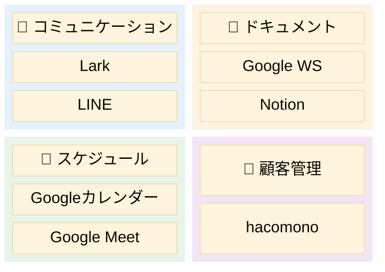

**⚠️ 問題点**: 7つのツールが分散 → 情報の重複・切替コスト発生

---

### 1.2 特定された課題

| 優先度 | 課題 | 影響 |
|:------:|------|------|
| 🔴 | **LINEグループの乱立** | 情報が追えない |
| 🔴 | **問い合わせの属人化** | 特定担当者に集中 |
| 🔴 | **データの見える化不足** | 一覧化されていない |
| 🟡 | **ツールの分散** | ドキュメントが散在 |
| 🟡 | **店舗拡大への対応** | 現行体制では限界 |

---

### 1.3 課題の詳細分析

#### 課題①：LINEグループの乱立

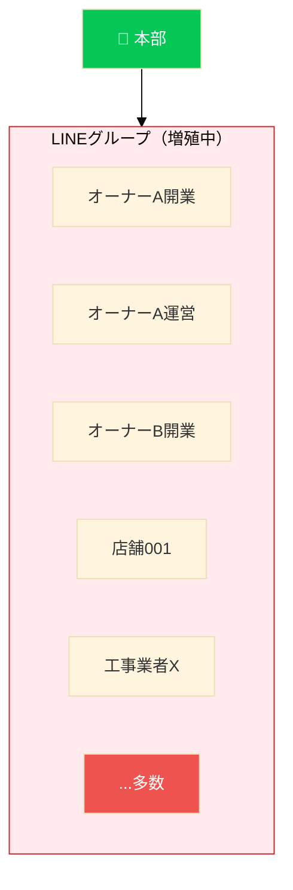

| 問題 | 影響 |
|:----:|------|
| ❌ | 重要情報が埋もれる |
| ❌ | 対応者が不明 |
| ❌ | 検索困難 |
| ❌ | 引継ぎ困難 |

---

#### 課題②：問い合わせ対応の肥大化

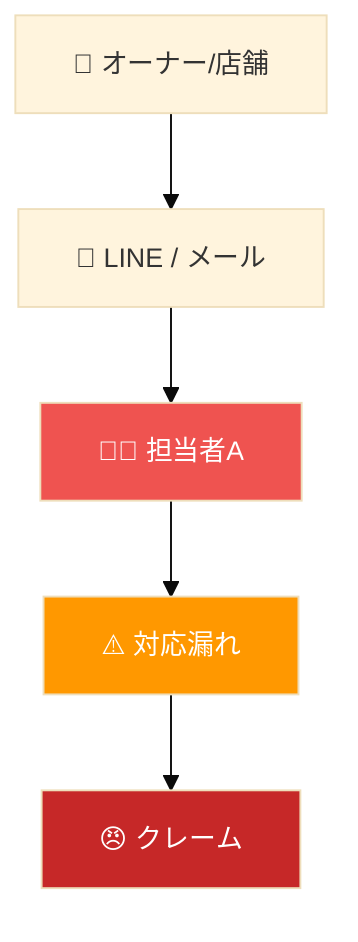

**月間対応件数（推定）**

| カテゴリ | 件数 |
|:--------:|:----:|
| 開業準備 | 50件 |
| 運営相談 | 100件 |
| 設備トラブル | 30件 |
| その他 | 50件 |
| **合計** | **230件** |

---

#### 課題③：データの見える化不足

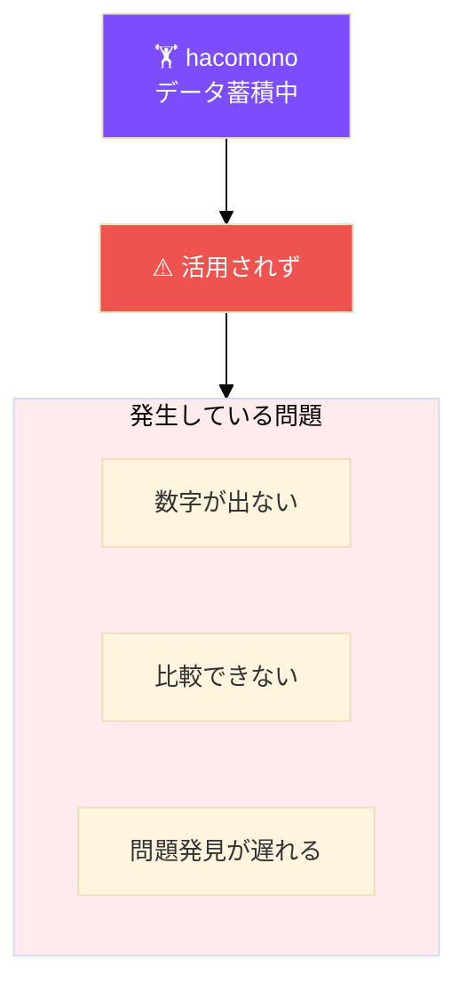

---

## 2. 提案：Lark統合ソリューション

### 2.1 To-Be 構成

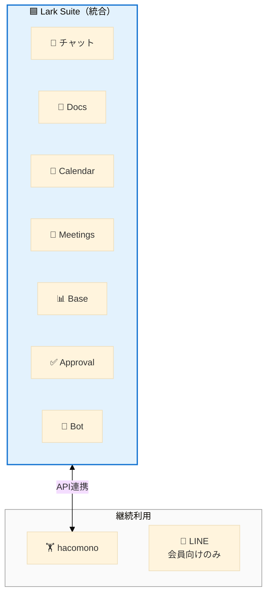

---

### 2.2 残すもの・置き換えるもの

| ツール | 判断 | 理由 |
|:------:|:----:|------|
| **Lark** | ✅ 拡張 | 全機能をフル活用 |
| **hacomono** | ✅ 継続 | Lark Baseと連携 |
| **LINE（会員向け）** | ✅ 継続 | 会員連絡用 |
| Google Workspace | ❌ | → Lark Docs |
| Notion | ❌ | → Lark Wiki |
| Google Calendar | ❌ | → Lark Calendar |
| Google Meet | ❌ | → Lark Meetings |
| LINE（業務用） | ❌ | → Lark Messenger |

---

## 3. ソリューション詳細

### 3.1 課題①解決：Lark組織チャット

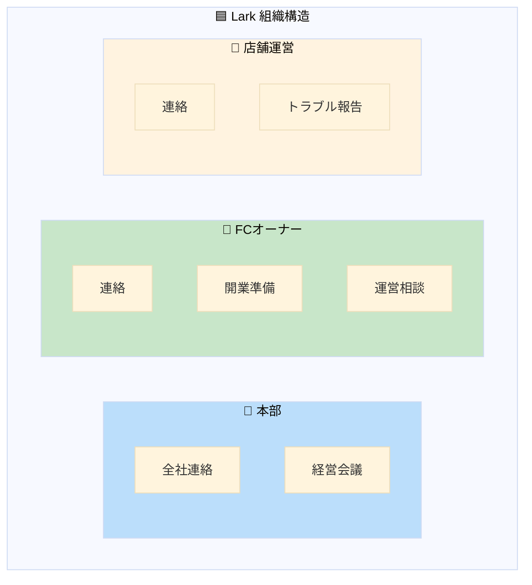

| 機能 | 効果 |
|:----:|:----:|
| スレッド | 会話整理 |
| 検索 | 即座に発見 |
| 権限 | アクセス制御 |
| Bot | 自動振分 |

---

### 3.2 課題②解決：問い合わせ自動化

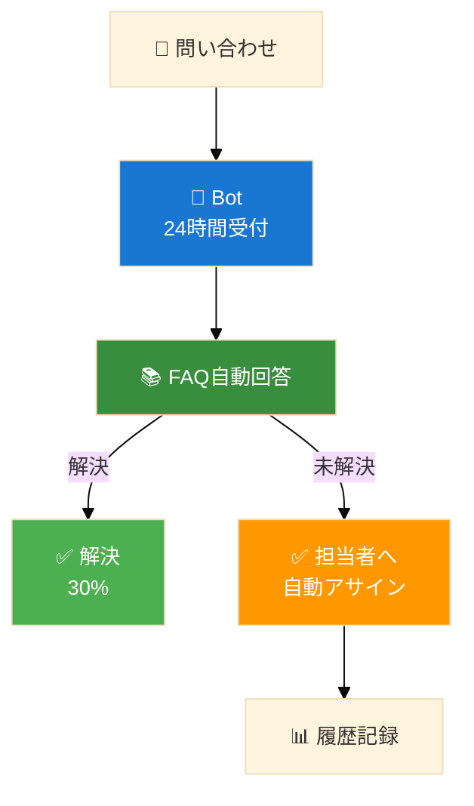

| 効果 | 詳細 |
|:----:|:----:|
| FAQ自動回答 | 30%即時解決 |
| 自動アサイン | 属人化解消 |
| 履歴蓄積 | ナレッジ化 |

---

### 3.3 課題③解決：データ可視化

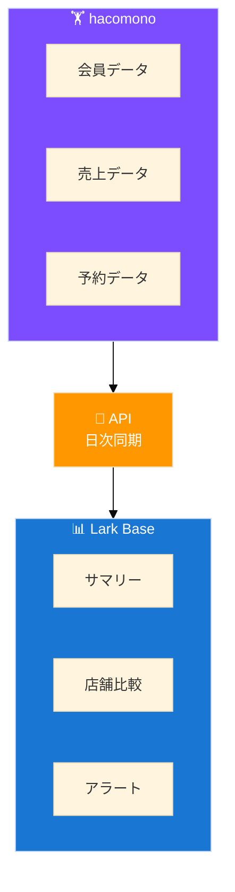

#### 経営ダッシュボード例

| 指標 | 値 | 前月比 |
|:----:|:----:|:------:|
| 総会員数 | 45,230人 | +2.3% |
| 総売上 | ¥148.5M | +5.1% |
| 平均客単価 | ¥3,280 | +1.2% |

| 店舗 | 会員数 | 売上 | 状態 |
|:----:|:------:|:----:|:----:|
| 渋谷店 | 1,250 | ¥4.1M | 🟢 |
| 新宿店 | 980 | ¥3.2M | 🟡 |
| 池袋店 | 650 | ¥2.1M | 🔴 |

---

### 3.4 開業オペレーション標準化

```mermaid
%%{init: {'theme': 'base', 'themeVariables': {'fontSize': '12px'}}}%%
gantt
    title 新店舗開業（90日間）
    dateFormat X
    axisFormat %s

    section 契約準備
    FC契約      :done, 90, 80
    物件契約    :done, 85, 75
    設計確定    :done, 80, 70

    section 工事
    内装工事    :active, 60, 35
    機器搬入    :35, 30

    section 開業準備
    採用        :30, 15
    オープン    :milestone, 0, 0
```

**自動化ポイント**
- ✅ タスク完了 → 次担当者に自動通知
- ✅ 期限超過 → エスカレーション
- ✅ 進捗 → ダッシュボードに自動反映

---

## 4. 導入効果試算

### 4.1 コスト比較

| 項目 | 現状/月 | 導入後/月 |
|:----:|:-------:|:---------:|
| Google WS | ¥68,000 | ¥0 |
| Notion | ¥45,000 | ¥0 |
| Lark Pro | ¥0 | ¥120,000 |
| **合計** | **¥113,000** | **¥120,000** |

※ 微増だが、業務効率化効果で十分回収

---

### 4.2 業務効率化効果

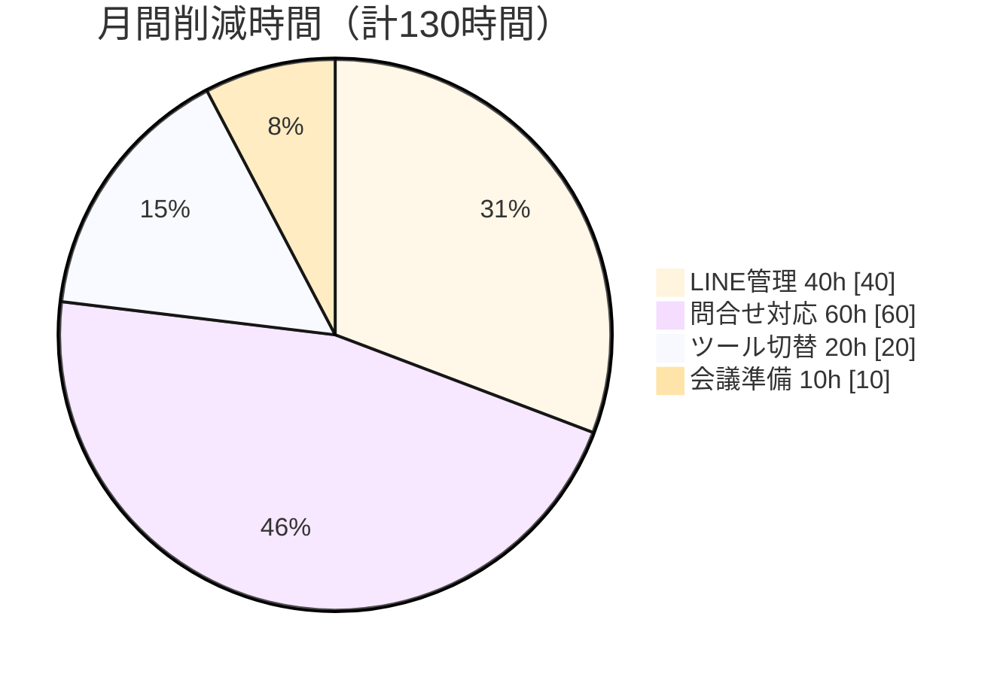

| 効果項目 | 削減時間 | 金額換算 |
|:--------:|:--------:|:--------:|
| LINE管理 | 40h | ¥120,000 |
| 問い合わせ対応 | 60h | ¥180,000 |
| ツール切替 | 20h | ¥60,000 |
| 会議準備 | 10h | ¥30,000 |
| **合計** | **130h** | **¥390,000/月** |

### 🎯 年間削減効果: 約470万円

---

## 5. 導入スケジュール

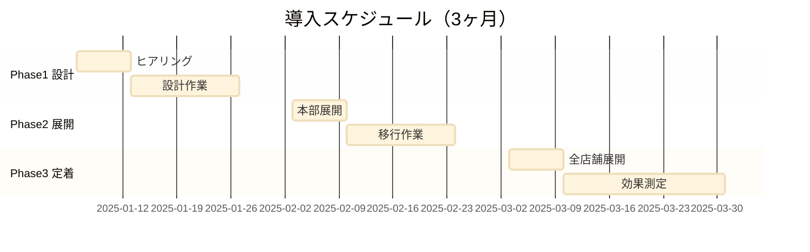

### 各フェーズの詳細

| Phase | 期間 | 主な作業 |
|:-----:|:----:|----------|
| **1** | Week 1-4 | ヒアリング、設計、Bot開発 |
| **2** | Week 5-8 | 本部展開、移行、トレーニング |
| **3** | Week 9-12 | 全店舗展開、効果測定 |

---

## 6. 成功のためのポイント

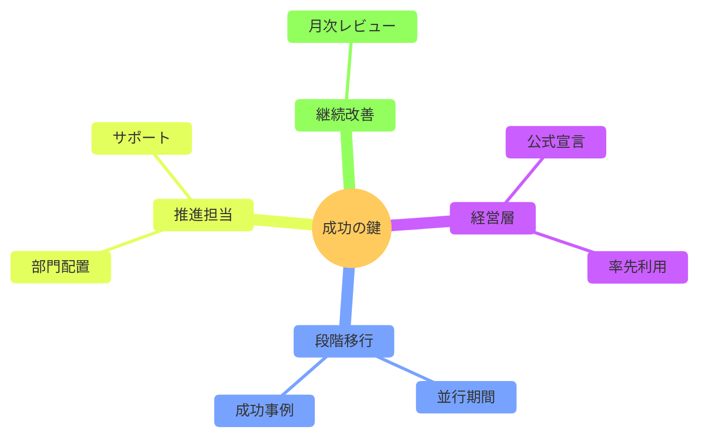

---

## 7. なぜ今Larkなのか

### 7.1 店舗拡大への対応

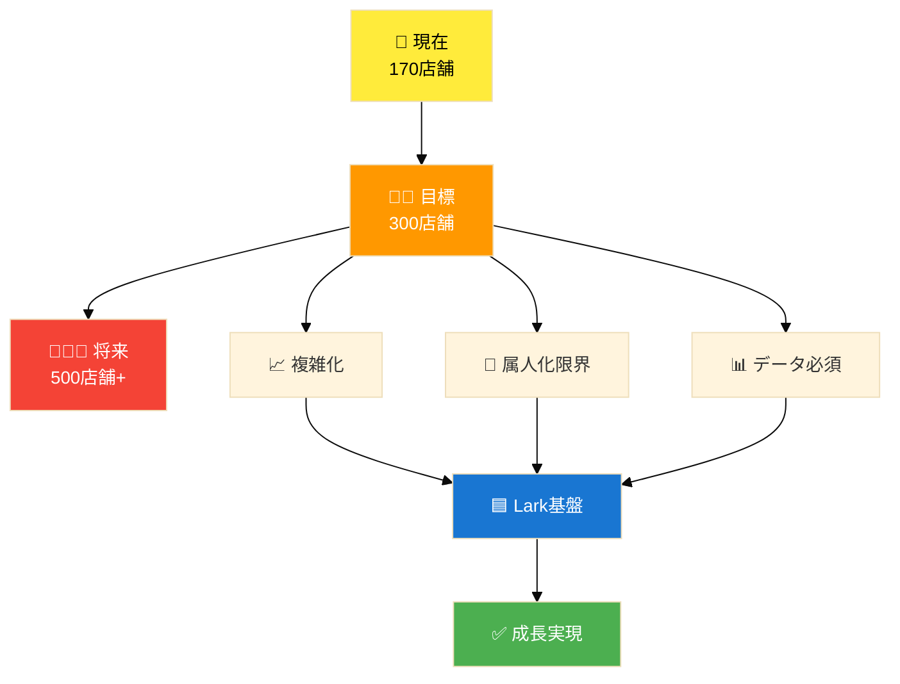

---

### 7.2 競合比較

| 要件 | Lark | Slack | Teams |
|:----:|:----:|:-----:|:-----:|
| オールインワン | ⭕ | ❌ | 🔺 |
| 外部ユーザー | ⭕ | 🔺 | 🔺 |
| ノーコードDB | ⭕ | ❌ | ❌ |
| ワークフロー | ⭕ | 🔺 | 🔺 |
| コスト | ◎ | ❌ | 🔺 |

---

## 8. 次のステップ

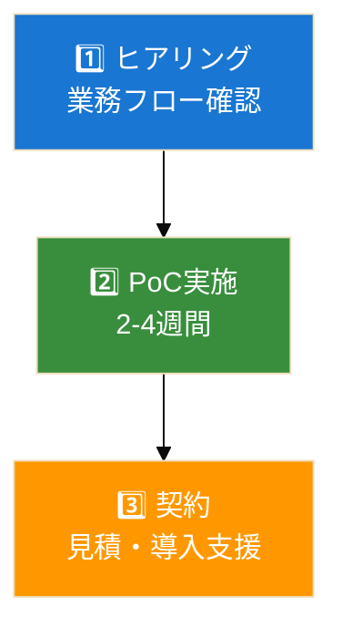

---

### お問い合わせ

| 項目 | 内容 |
|:----:|:----:|
| 会社名 | [提案会社名] |
| 担当者 | [担当者名] |
| Email | [email] |
| Tel | [電話番号] |

---

## 付録

### A. Lark機能一覧

| 機能 | 説明 | 活用例 |
|:----:|------|--------|
| Messenger | チャット | 本部-店舗連絡 |
| Docs | ドキュメント | マニュアル |
| Base | ノーコードDB | KPIダッシュボード |
| Approval | 承認フロー | 申請自動化 |
| Bot | チャットボット | 問い合わせ対応 |

---

### B. hacomono連携

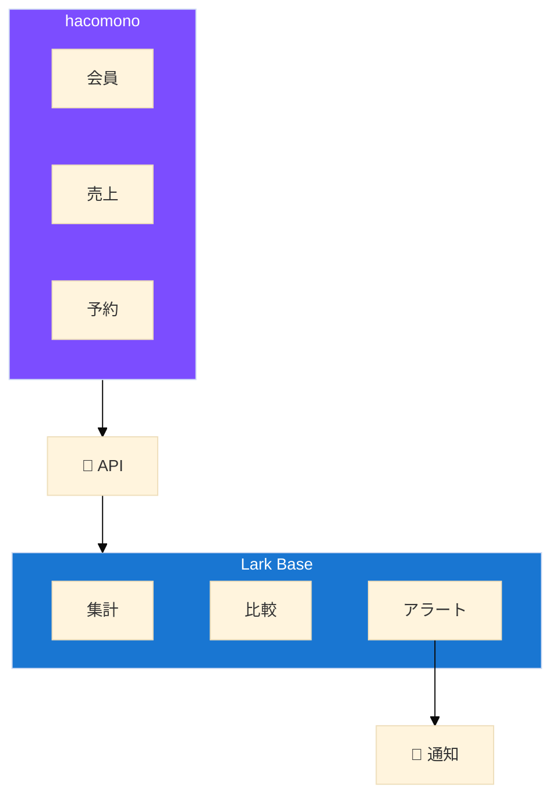

---

### C. 用語集

| 用語 | 説明 |
|:----:|------|
| Lark Base | ノーコードDB |
| Approval | 承認ワークフロー |
| hacomono | フィットネスCRM |
| FC | フランチャイズ |

---

*この提案書は [Claude Code](https://claude.com/claude-code) により生成されました*

**FIT PLACE24様の更なる成長を、Larkがサポートします。**
